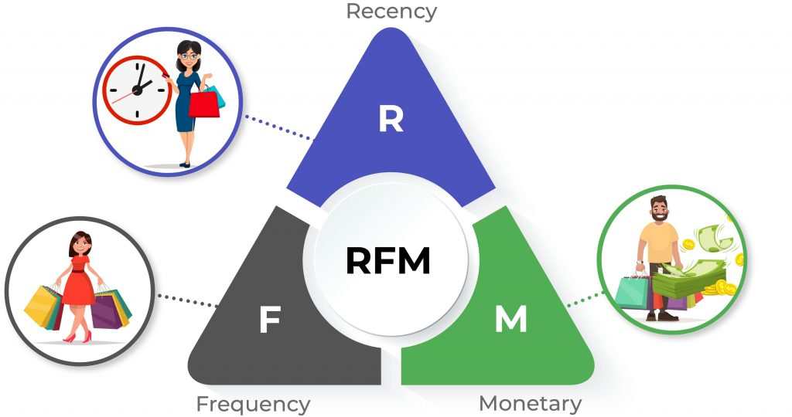

# RFM segmentasyonu için uygulama kodudur. Teorik anlatımına [**Medium Yazısı**]() buradan ulaşabilirsiniz.

# Repository Hakkında

Veri olarak online olarak hediyelik eşyalar satan İngiltere'de bulunan bir mağazanın 01/12/2009 - 09/12/2011 arasındaki satışlarını kullanıyoruz.
Bu veri setiyle birlikte müşterilerin geçmiş davranışlardan yola çıkarak, RFM segmentasyonu ile müşterilerimizi sınıflara ayırarak hangi sınıfa hangi pazarlama stratejilerini uygulamalıyız, hangi aksiyonları almalıyız gibi bir çok konuyu gerçekleştirebiliyor hale geliyoruz.
Medium yazısı üzerinde RFM nedir, nasıl uygulanır, neden RFM gibi bir çok bilgi baştan sona her şey detaylı şekilde anlatılmıştır.
Sorularınız olursa iletişim adresimden bana ulaşabilirsiniz. İyi çalışmalar.

# Veri

- online_retail_II.xlsx - [**Data source**](https://archive.ics.uci.edu/ml/datasets/Online+Retail+II)

# Veri Detayı

- InvoiceNo: Fatura numarası. Her işleme yani faturaya ait eşsiz numara. Eğer bu kod C ile başlıyorsa işlemin iptal edildiğini ifade eder.
- StockCode: Ürün kodu. Her bir ürün için eşsiz numara.
- Description: Ürün ismi
- Quantity: Ürün adedi. Faturalardaki ürünlerden kaçar tane satıldığını ifade etmektedir.
- InvoiceDate: Fatura tarihi ve zamanı.
- UnitPrice: Ürün fiyatı (Sterlin cinsinden)
- CustomerID: Eşsiz müşteri numarası
- Country: Ülke ismi. Müşterinin yaşadığı ülke.

# Kütüphaneler

- pandas
- numpy
- datetime

# Yazar

- Alper Temel [Author](https://github.com/alpertml)

# İletişim

• tml.alper@gmail.com
